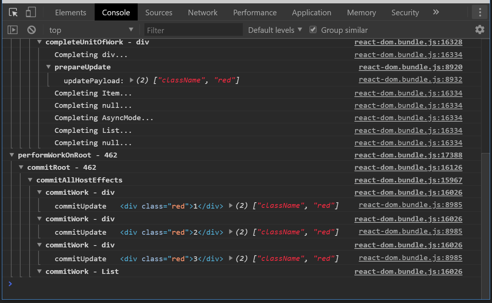

# React Suspense Sandbox

A sandbox for playing around with React suspense

See the READMEs for each folder in `src/` for a description of each sandbox in
this repo

## Getting started

1. Install NodeJS
2. Run `npm install`
3. Run `npm start`
4. Navigate your browser to `localhost:8080/fiber` or `localhost:8080/suspense`
5. Open the browser devtools to the Console tab
6. Click on some buttons on the webpage to see a function trace through React

