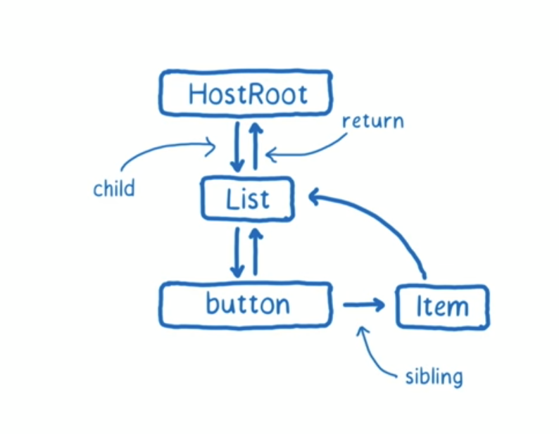
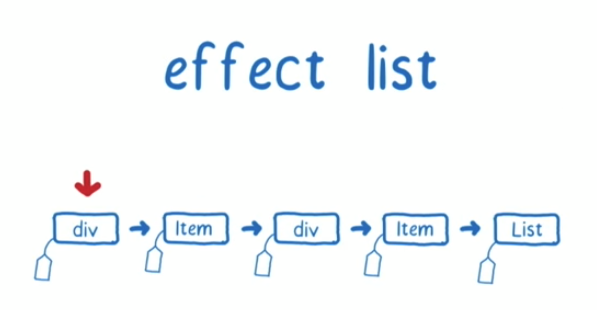
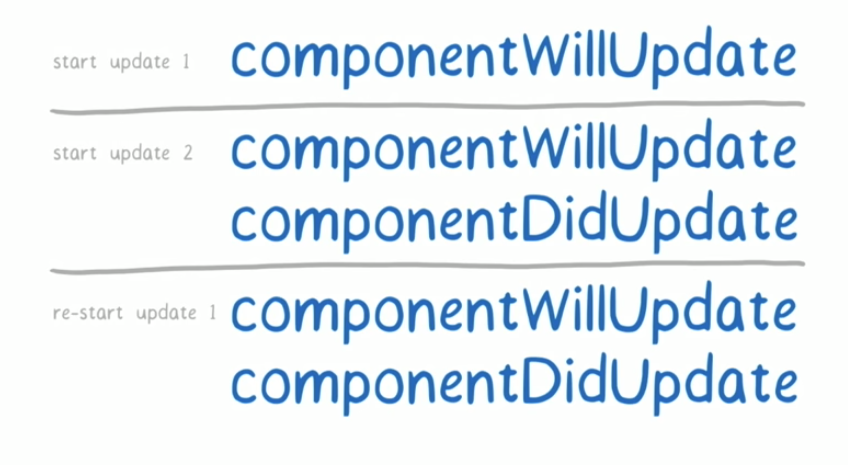

# A Cartoon Intro to Fiber Notes

TODO: Expand the process section with annotations calling out which methods deal
with which lines

HostRoot: container you injected React into the DOM with

## Fiber

Fiber Data structure:

<!--  -->

- stateNode - the component **instance** being worked on
- child - children components
- return - direct parent components
- sibling - sibling components (siblings have a return to the previous sibling)
- effect list - the list of child fiber changes that need to be committed

There are two trees: current & workInProgress (the next tree)

## Phases

- Render/reconcilation - builds list of changes, interruptible
- Commit - commit changes to DOM, not interruptible

## Work loop

- Does some computation, then comes up and yields to the main thread
- Keeps track of:
  - Next unit of work
  - Time remaining (i.e. deadline?)

## Process

- Button is pressed to square numbers

  - Button ends up calling deferSetState()
  - React adds update to queue
  - React uses requestIdleCallback to schedule work

- Phase 1: Render

  - Clones HostRoot, then List to workInProgress tree
  - React checks if it still has time left. It does so it continues.
  - List has an update! Calls the updater function passed into setState((state,
    props) => newState)
  - List is tagged because it needs to have a DOM update
  - React calls render on list and checks if it can reuse the children of list
    from the current tree
  - It can, so react copies the children from the current tree to workInProgress
    tree
  - React sets the workInProgress to the first child of List (button).
  - React checks it's deadline. It still has time so it continues
  - > User clicks a "change font size button". Is queued on main thread
  - Button doesn't have an children. So it completes the unit of work for button
    and continues to its siblings.
  - Next unit of work is an Item
  - React checks its deadline and continues.
  - The first Item in the list has a shouldComponentUpdate that returns false.
    So React doesn't update the component and marks it done
  - Since the Item has returned false from shouldComponentUpdate, its children
    are skipped. So the next unit of work is its sibling, another Item.
  - React checks its deadline and continues.
  - The second Item does need to change with the new prop so it gets tagged as
    needing DOM changes.
  - The second Item's child div is cloned to the workInProgress tree and is
    returned as the next unit work
  - React checks its deadline and continues.
  - Div doesn't have any children, so it is completed. We compare the old and
    new div and see that it changed so it gets a changed tag.
  - Since this div is completed and has a change tag, it gets added to its
    parents effect list.
  - Since the div is done, it calls complete() on its parent, Item 2.
  - Item 2 has no more children so it is completed and calls complete() on its
    parent. Since it has a change tag and an effect list, it merges its effect
    list to its parent, List, effect list. First it adds the div to the effect
    list, then itself.
  - The next unit work is the Item2 sibling, Item 3
  - > React runs out of time
  - > Main thread does it's other work, such as layout/paint/composite to update
    > the font size button
  - React then resumes its next unit of work
  - (Repeat what happened for Item 2 here)
    - Item 2 ends up adding its child div and itself to the List effect list
    - Effect list is now: div -> item (2) -> div -> item (3)
  - Now that list has no more children, List calls complete on its parent,
    moving its effect list up to the root.
    - Effect list is now: div -> Item (2) -> div -> Item (3) -> List
  - React sets the `workInProgress` tree as the `pendingCommit` tree
  - 

- Phase 2: Commit
  - <!--  -->
    
  - React moves through the effect list.
  - Updates the div from 2 -> 4
  - Item is next. If Item used refs, they would be detached, and re-attached
    later
  - Updates the div from 3 -> 9
  - Nothing happens on item
  - Nothing happens on List
  - Swap current pointer and workInProgress pointer now that workInProgress is
    commited
    - React keeps the old tree around so that it can recycle the nodes created
      building up the workInProgress tree to save time on memory allocation and
      garbage collection for future updates
  - It now applies the lifecycle methods to the effect list
    - componentDidUpdate
    - Update refs
    - Handle error boundaries

## Priority

Adding priority to Fibers to allow for time slicing, etc.

Current priorities:

- Synchronous // same as stack
- Task // before the next tick
- Animation // before next frame, using rAF
- High // pretty soon, using reqIdleCallback
- Low // minor delays ok, using reqIdleCallback (e.g. data fetching)
- Offscreen // prep for display/scroll (nice to have rendered in case it gets
  shown)

We want higher priority work to jump ahead of lower priority work. React will
not commit a tree if a higher priority work is scheduled first. React throws
away the work it did to respond to higher priority work. The lower priority work
is resumed once the higher pri work is done.

Some concerns:

- Repeatedly calling lifecycle methods. Example:

  <!--  -->
  

- Low priority starvation
  - React tries to re-use trees
  - Other mitigations are being explored

This mechanism of units of work and priority updates is called **cooperative
scheduling**.

## Things Fiber could enable

- Streaming rendering
- Handling work in parallel, efficiently (by splitting up branches of the tree
  to work in parallel).
